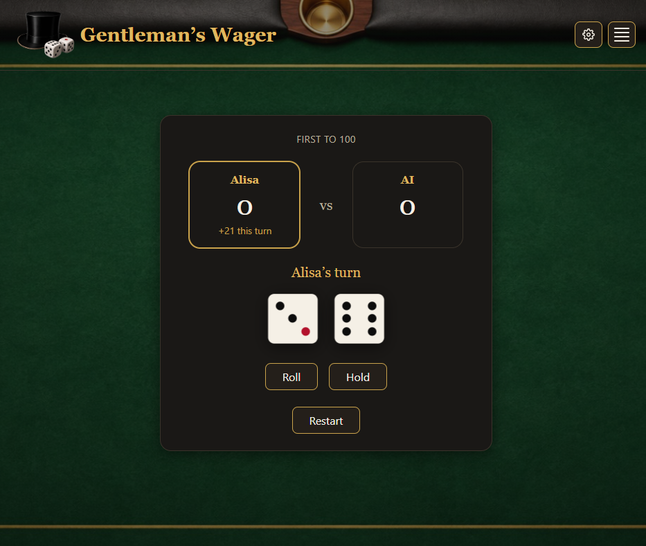

# 🎩 Gentleman's Wager

A push-your-luck dice game (2 players, or 1 player vs. a seeded computer
opponent), built as a home assignment for Roeto, dressed up as a
Victorian gentleman's-club wager. Roll two dice as many times as you
dare; each roll adds to your round score, but rolling 6 & 6 wipes it out
and passes the turn. Hold to bank what you've rolled — first to the
winning score (100 by default, configurable per game) wins.

This is a small monorepo:

```
/backend-api   NestJS API — owns every game rule, the database, auth, caching
/frontend      React + Vite SPA — displays state and calls the API, no game logic of its own
```

For the full design rationale (why NestJS, why SQLite+Redis, the
persistence/caching trade-offs, what was deliberately left out and why)
see [`ARCHITECTURE.md`](./ARCHITECTURE.md), which also has a diagram of
how the pieces fit together. This file is "what did we build and how do
I run it."

## What was built

- Full game rules on the backend (roll / hold / bust / win), with a
  domain layer that has zero framework imports and is unit-tested in
  isolation.
- JWT-based auth (simplified: username only, no password — see
  `ARCHITECTURE.md` §10 for why), so every game action is still gated by
  a real token check.
- Two human players simulated on one page (per the assignment brief), or
  one human vs. a seeded AI opponent that plays its turns automatically
  with a simple push-your-luck heuristic.
- A win-counter leaderboard, paginated and Redis-cached.
- SQLite (via Prisma, WAL mode) as the source of truth, with a
  batched/write-behind persistence strategy and a Redis cache-aside layer
  for the leaderboard — both designed to minimize database writes without
  risking data that matters (`ARCHITECTURE.md` §8–9).
- Rate limiting and health-check endpoints (`/health/live`, `/health/ready`).
- A themed, responsive React frontend: a 3D dice tray, a hover-reveal
  navigation menu, and a settings menu for background music/sound
  effects with independent on/off toggles and a shared volume slider.
- Docker + docker-compose packaging for a one-command spin-up of the
  whole stack.

## Technologies used

**Backend** — NestJS, TypeScript, Prisma ORM over SQLite (WAL mode),
Redis (cache-aside + write-behind buffer), JWT auth, `@nestjs/throttler`
for rate limiting, `@dice-roller/rpg-dice-roller` (with Node's crypto RNG
engine) for dice rolls, Swagger/OpenAPI for interactive API docs, Jest +
Supertest for unit and e2e tests.

**Frontend** — React 18, TypeScript, Vite, styled-components (with
`babel-plugin-styled-components` for readable debug class names),
TanStack Query for data-fetching, Motion for React for animation,
Vitest + React Testing Library for tests.

**Infrastructure** — Docker + docker-compose (`api`, `frontend`, `redis`
services), nginx serving the built frontend's static files.

See `ARCHITECTURE.md` §3 for the same list with the reasoning behind
each choice.

## Cross-platform

Both halves of the stack are plain Node.js/TypeScript with no
OS-specific code, so `npm install` / `npm run dev` work identically on
Windows, macOS, and Linux. The Docker path is the most cross-platform
option of all — `docker compose up --build` builds and runs the same
Linux containers regardless of the host OS (Windows via Docker
Desktop/WSL2, macOS, or native Linux), so the whole stack behaves
identically everywhere without any host-specific setup.

## Running it

### With Docker (the whole stack, one command)

From the repo root:

```bash
docker compose up --build
```

This starts three services:

| Service | Container port | Host URL |
|---|---|---|
| `frontend` | 80 (nginx, serving the Vite build) | http://localhost:5173 |
| `api` | 3000 | http://localhost:3000 |
| `redis` | 6379 | `redis://localhost:6379` |

The SQLite database file lives on a named Docker volume (`api-data`), so
it survives `docker compose down` (but not `docker compose down -v`).
The frontend is built with `VITE_API_BASE_URL=http://localhost:3000`
baked in (a Docker build `ARG`), since the browser talks to the API's
host-mapped port directly, not the Docker-internal service name.

### Without Docker (running each half yourself)

You need the backend (and, optionally, Redis — the app degrades
gracefully without it) running before the frontend can do anything
useful.

**1. Backend:**

```bash
cd backend-api
npm install
cp .env.example .env
npx prisma generate
npx prisma migrate dev --name init
npm run db:seed        # AI opponent + a couple of demo leaderboard entries
npm run start:dev
```

API listens on `http://localhost:3000`; interactive docs at
`http://localhost:3000/docs`. Full detail (rate limits, testing, the
persistence/caching internals, a curl walkthrough) is in
[`backend-api/README.md`](./backend-api/README.md).

The database file itself (`backend-api/prisma/dev.db`) is intentionally
**not** committed to the repo — it's binary, tied to whatever migration
state it was created under, and would otherwise carry one person's local
test data. `npm run db:seed` is the reproducible alternative: it always
runs against the current schema and leaves you with a non-empty
leaderboard instead of a blank one. See
[`backend-api/README.md`](./backend-api/README.md#demo-data) for exactly
what it seeds. The Docker path above runs this automatically on every
container start, so it only needs doing by hand here.

Redis is optional here — without `REDIS_URL` reachable, the app still
works, just without the cache speed-up. To run it locally:

```bash
docker run -p 6379:6379 redis:7-alpine
```

**2. Frontend**, in a second terminal:

```bash
cd frontend
npm install
cp .env.example .env    # VITE_API_BASE_URL, defaults to http://localhost:3000
npm run dev
```

Frontend dev server: `http://localhost:5173`. Full detail (scripts, the
sound feature and where its audio files live, folder layout, testing) is
in [`frontend/README.md`](./frontend/README.md).

## Documentation map

- [`ARCHITECTURE.md`](./ARCHITECTURE.md) — design decisions, trade-offs,
  the architecture diagram, and what was deliberately deferred and why.
- [`backend-api/README.md`](./backend-api/README.md) — running/testing
  the API, its `src/` layout, persistence and caching internals, a curl
  walkthrough.
- [`frontend/README.md`](./frontend/README.md) — running/testing the
  UI, its `src/` layout, theming, and the sound feature.

## Future improvements

Deliberately left out of this assignment (each is a real production
concern, but none solves an actual problem at this project's current
scale — see `ARCHITECTURE.md` §15 for the full reasoning):

- Real OAuth2/SSO login in place of the current mock username-only auth
  — the `IAuthProvider` interface already supports swapping this in
  without touching guards or controllers.
- A full observability/metrics stack (Prometheus/Grafana: latency,
  error rate, DB/Redis health) — worth adding once there's more than one
  running instance to compare against.
- Kubernetes deployment manifests — the `/health/live` and
  `/health/ready` endpoints are already probe-compatible, just unused.
- Pushing leaderboard pagination fully into the database query
  (`skip`/`take`) instead of caching the whole sorted list and slicing
  it in memory — the right move once the player count grows enough for
  that to matter (see `ARCHITECTURE.md` §9 for the trade-off as it
  stands today).
- Real cross-browser/cross-device live multiplayer (websockets) instead
  of simulating two players in one page's memory, if a "play against a
  friend on another machine" mode is ever wanted.
- A configurable data-retention policy for leaderboard/rating history.
- Proper short "sting" recordings for the roll/win sound effects — the
  shipped files are longer clips manually capped to their first second
  in code (`frontend/src/sound/soundLibrary.ts`) because no short
  versions were available.
- User-uploaded avatars, instead of the current fixed built-in set.

## Author

Alisa Rakhlina — aliska76@gmail.com
